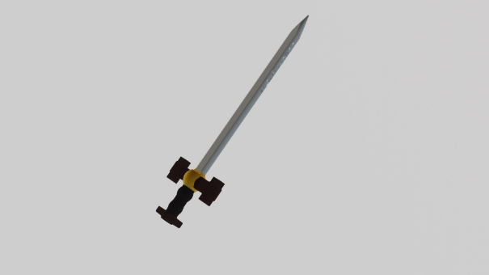
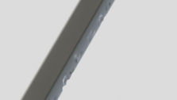

TP Surfaces Implicites

Skander Zoghlami November 3, 2023

1  Surfaces implicites

20454 Triangles        Maillés en 256x256x256

Primitives utilisés Cone 

Capsule Boites Sphères Tores 

Opérateurs Binaires utilisés Unions 

Différences 

Unions Lisses 

Bombardement de 100 différences de sphères (rayon=0.05) Avec l’outil d’érosion

Figure 1: Rendu Blender d’une surface implicite mod´elis´ee et maill´ee avec TinyMesh

Cinq classes ont ´et´e cr´e´ees pour mod´eliser les formes primitives utilis´ees pour cr´eer l’´ep´ee (Cˆone, Capsule, Boˆıte, Sph`ere, Tore) en h´eritant de la classe AnalyticalScalarField et en faisant des overrides de la fonction Value.

Pour combiner les primitives et mod´eliser l’arbre hi´erarchique, une nouvelle classe est cr´e´ee h´eritant de AnalyticalScalarField et ayant deux fils (gauche et droit). Ensuite, diff´erentes classes de nœuds sont cr´e´ees en h´eritant de la classe d’arbre, chaque nœud repr´esentant une op´eration binaire (Union/Intersection/Diff´erence/UnionLiss´ee/IntersectionLiss´ee).

La figure[ 1 ](#_page0_x70.87_y282.03)est une visualisation Blender du r´esultat final, tandis que la figure 2 [repr](#_page1_x70.87_y130.97)´esente l’arbre hi´erarchique utilis´e et explique pourquoi chaque nœud a ´et´e cr´e´e. Le choix de passer de l’union liss´ee `a l’union standard est enti`erement bas´e sur des pr´ef´erences subjectives.

2

15386  Triangles          ![ref1]Temps de Calcul: 1873 ms 

Smooth Union

 

(a) Corps de l’´ep´ee

19754  Triangles         ![ref2]Temps de Calcul: 3597 ms 

Smooth Union

![ref3] 

(c) Golden sphere

19922     Triangles        ![ref4]Temps de Calcul: 6459 ms 

Différence

![ref5]  ![ref6]![ref6]

(e) Rendant l’´ep´ee plus tranchante

18858  Triangles         Temps de Calcul: 2746 ms 

Union![ref3]

![ref1] 

(b) CrossGuard

22154  Triangles        ![ref7]Temps de Calcul: 5807 ms 

Smooth Union

Union

![ref2]   ![ref8]![ref6]![ref9]

(d) D´ecorations sur les cˆot´es

20338 Triangles          ![ref10]Temps de Calcul: 7379 ms 

Smooth Union

![ref4]  ![ref11]![ref12]

6) D´ecorations sur le handle

20454 Triangles           Temps de Calcul: 79243 ms 

Différence

. . .![ref10]![ref13]![ref13]

7) Erosions´

Figure 2: Arbre de Construction Hi´erarchique

2  Intersection avec une droite

Pour trouver l’intersection entre un rayon envoy´e de la cam´era jusqu’au point ou` l’utilisateur a cliqu´e, l’algorithme de ”sphere tracing” a ´et´e utilis´e avec les param`etres suivants : lambda (Lipschitz) = 1, epsilon (distance minimale pour d´etecter l’occultation) = 0,01 et un nombre maximal d’it´erations = 100 pour ´eviter de boucler ind´efiniment.

Deux tests ont ´et´e r´ealis´es, le premier avec une ”bounding box” enveloppant la surface et l’autre sans. La d´etection des occultations est plus facile dans le premier cas, et plus d’occultations sont d´etect´ees (en fonction de la largeur/hauteur de la ”bounding box”). Cependant, lorsqu’il est test´e avec l’outil d’´erosion, la plupart des sph`eres sont trop ´eloign´ees de l’objet et le calcul de la diff´erence ne modifie pas l’objet principal. Par cons´equent, la deuxi`eme m´ethode est conserv´ee pour l’outil d’´erosion.

3  Outil d’´erosion

L’outil d’´erosion utilise l’algorithme de ”sphere tracing” d´efini pr´ec´edemment pour trouver l’intersection entre le rayon envoy´e de la cam´eraa` l’endroit ou` l’utilisateur a cliqu´e et la surface. Si une intersection est trouv´ee, la position est enregistr´ee, et 10 petites sph`eres de rayon (0,05) sont envoy´ees autour du point d’impact. Chaque clic de l’utilisateur ajoute 10 nouvelles sph`eres et augmente donc consid´erablement le temps de calcul. La figure 3 montre l’´evolution du temps de calul en fonction des points ajout´es.

Temps de Calcul en fonction des points ajoutés

1\.0 

Temps de calul (ms) 80000 70000

0\.8

60000

0\.6 50000 40000

0\.4

30000

0\.2 20000 10000

0\.0

0 10 20 30 40 50 60 70 80 90

Figure 3: Temps de Calcul en fonction du nombre de points
3

[ref1]: Aspose.Words.22263087-c611-44b4-9209-7d5758c2011e.007.png
[ref2]: Aspose.Words.22263087-c611-44b4-9209-7d5758c2011e.011.png
[ref3]: Aspose.Words.22263087-c611-44b4-9209-7d5758c2011e.012.png
[ref4]: Aspose.Words.22263087-c611-44b4-9209-7d5758c2011e.015.png
[ref5]: Aspose.Words.22263087-c611-44b4-9209-7d5758c2011e.016.png
[ref6]: Aspose.Words.22263087-c611-44b4-9209-7d5758c2011e.017.png
[ref7]: Aspose.Words.22263087-c611-44b4-9209-7d5758c2011e.021.png
[ref8]: Aspose.Words.22263087-c611-44b4-9209-7d5758c2011e.022.png
[ref9]: Aspose.Words.22263087-c611-44b4-9209-7d5758c2011e.023.png
[ref10]: Aspose.Words.22263087-c611-44b4-9209-7d5758c2011e.025.png
[ref11]: Aspose.Words.22263087-c611-44b4-9209-7d5758c2011e.026.png
[ref12]: Aspose.Words.22263087-c611-44b4-9209-7d5758c2011e.027.png
[ref13]: Aspose.Words.22263087-c611-44b4-9209-7d5758c2011e.030.png
